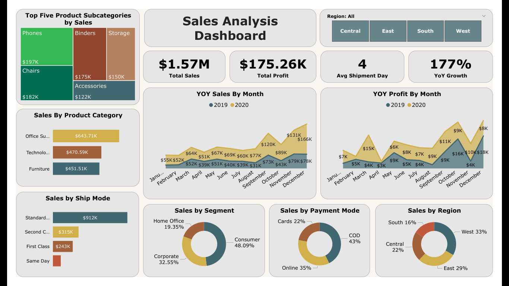

# SuperStore Sales Dashboard

## Overview
This project involves creating an interactive Power BI dashboard for analyzing sales and profit trends using Superstore data. The dashboard includes key performance indicators (KPIs), YoY growth analysis, and product category performance.

## Features
- **Key Metrics**: Total Sales, Total Profit, YoY Growth, and Average Shipment Days.
- **Visuals**:
  - Treemap: Top 5 product subcategories by sales.
  - Line Charts: YoY sales and profit trends.
  - Pie Charts: Sales by region, segment, and payment mode.
- **Interactivity**: Region filter for detailed analysis.

## Files Included
- **Dashboard**:
  - `SuperStoreSalesDashboard.pbix`: Power BI file.
  - `SuperStoreSalesDashboard.png`: Preview of the dashboard.
- **Data**:
  - `SuperstoreData.xlsx`: Dataset used for the analysis.

## How to Use
1. Download the `.pbix` file.
2. Open it in Power BI Desktop.
3. Explore the dashboard and interact with visuals.

## Tools Used
- **Power BI Desktop**
- **Excel**: For data preprocessing.
- **DAX**: For creating measures like YoY Growth and KPIs.

## Preview

## Contact
Feel free to connect via [LinkedIn](https://linkedin.com/in/rishjaiswal) or email at jrishabh444@gmail.com for any questions or feedback.
